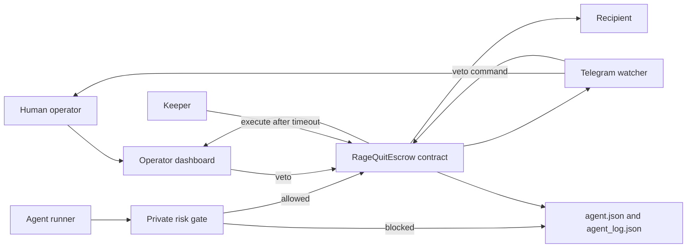
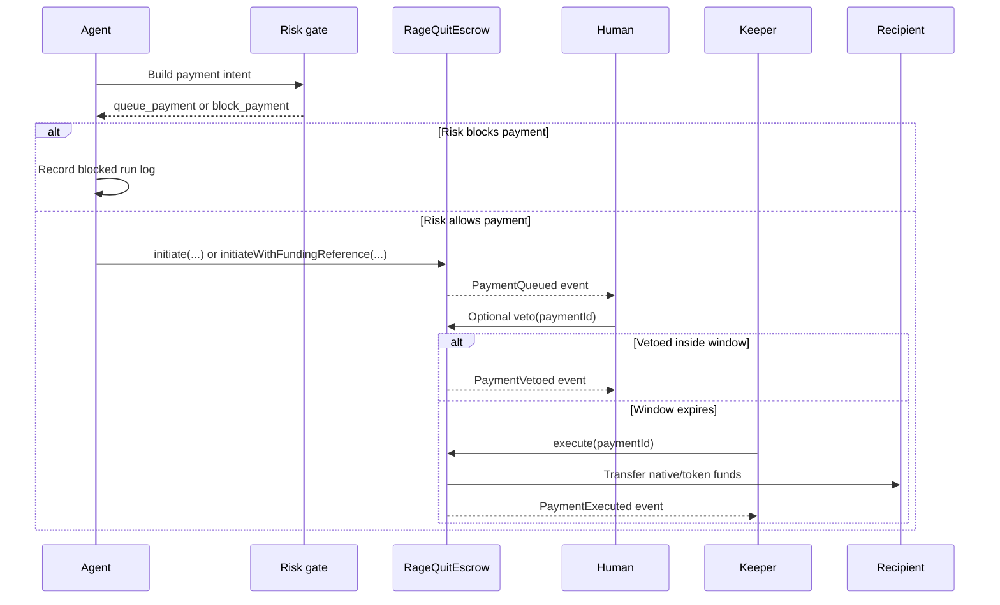
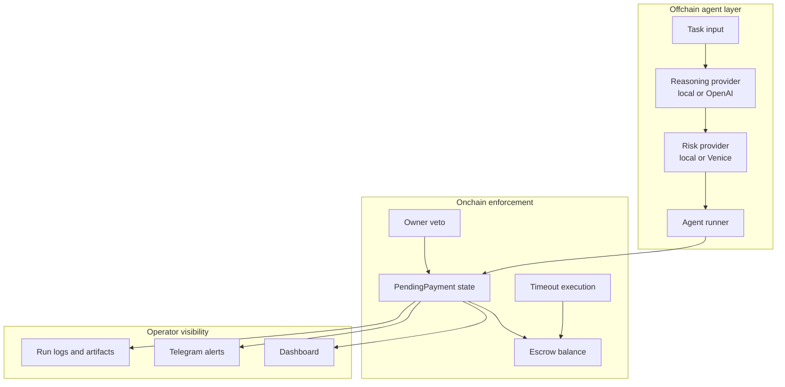

# RageQuit Escrow

RageQuit Escrow is a payment safety layer for autonomous agents. It lets an agent prepare and queue a payment, but final settlement is delayed by an onchain veto window controlled by the human operator.

The project is built around one principle: agentic payments should be observable and revocable before they become irreversible.

## Why This Exists

Autonomous agents are increasingly able to reason about tasks, choose recipients, and trigger financial actions. That is useful, but the failure mode is harsh: a single wrong transfer can be final.

RageQuit Escrow changes the execution model. Instead of granting an agent direct transfer authority, the agent can only create a pending payment. The human receives visibility through the dashboard and Telegram, and the contract enforces a bounded window where the human can cancel the payment.

This gives the system three practical safety properties:

- **Delay before finality**: payments are queued first and can only settle after `unlocksAt`.
- **Human last word**: the owner can veto while the window is open.
- **Auditable intent**: each payment carries an `intentHash`, optional `fundingReference`, and decision events.

## System Overview



The core contract is intentionally small. Most surrounding code exists to make the payment lifecycle visible, testable, and easy to operate from local development through testnets.

## Payment Lifecycle



The contract recognizes three decisions:

- `Queued`: an authorized agent locked funds into a pending payment.
- `Vetoed`: the owner cancelled the payment before `unlocksAt`.
- `Executed`: the veto window closed and the payment settled.

## Contract Model

The escrow contract lives at [contracts/contracts/RageQuitEscrow.sol](/c:/projects/ragequit-escrow/contracts/contracts/RageQuitEscrow.sol).

Key roles:

- `owner`: can veto payments and update configuration.
- `authorizedAgent`: can queue payments.
- `keeper`: any account can call `execute` once a payment is mature.

Key limits:

- `vetoWindow`: delay before execution is allowed.
- `spendLimit`: maximum amount for one payment.
- `settlementToken`: zero address for native settlement, or ERC-20 address for token settlement.

Core functions:

- `fund()`: owner funds native-mode escrow.
- `fundToken(amount)`: owner funds token-mode escrow.
- `initiate(recipient, amount, intentHash)`: authorized agent queues a native or token payment.
- `initiateWithFundingReference(recipient, amount, intentHash, fundingReference)`: queues with an external funding or swap reference.
- `veto(paymentId)`: owner cancels during the veto window.
- `execute(paymentId)`: settles after the veto window.
- `canExecute(paymentId)`: view helper for keepers and UIs.

## Trust Boundaries



The offchain agent can recommend and queue a payment, but cannot bypass the contract checks. The contract enforces spend limits, escrow balance, agent authorization, veto timing, and final settlement.

## Repository Layout

- [contracts](/c:/projects/ragequit-escrow/contracts): Hardhat workspace for Solidity contracts, tests, deploy scripts, agent runner, keeper, Telegram watcher, and generated state.
- [frontend](/c:/projects/ragequit-escrow/frontend): Next.js operator dashboard.
- [agent.json](/c:/projects/ragequit-escrow/agent.json): generated agent metadata.
- [agent_log.json](/c:/projects/ragequit-escrow/agent_log.json): generated audit log.

Important scripts:

- [deploy.js](/c:/projects/ragequit-escrow/contracts/scripts/deploy.js): deploys escrow and optional local mocks.
- [agentRunner.js](/c:/projects/ragequit-escrow/contracts/scripts/agentRunner.js): builds payment intents, runs risk checks, queues payments, and records run logs.
- [keeper.js](/c:/projects/ragequit-escrow/contracts/scripts/keeper.js): executes mature payments.
- [telegramWatcher.js](/c:/projects/ragequit-escrow/contracts/scripts/telegramWatcher.js): sends Telegram alerts, edits countdowns, and handles Telegram veto commands.
- [generateAgentArtifacts.js](/c:/projects/ragequit-escrow/contracts/scripts/generateAgentArtifacts.js): writes `agent.json` and `agent_log.json`.

## Features

- Native and ERC-20 escrow settlement
- Owner-controlled veto window
- Spend limit per payment
- Private risk gate before queueing
- Telegram alerts with countdowns and veto commands
- Dashboard veto flow
- Keeper-based post-timeout execution
- Local mock token and mock swap router
- Optional Uniswap V3-style swap path configuration
- MetaMask smart-account and delegation helpers
- Celo Alfajores network support
- ENS, Self, and payment-rail metadata in generated artifacts

## Local Development

<<<<<<< HEAD
Install dependencies:
=======
1. An agent receives a task and constructs a payment intent.
2. The runner hashes the intent and evaluates risk privately.
3. If allowed, the agent queues the payment onchain instead of transferring immediately.
4. Telegram alerts and the dashboard expose the pending payment.
5. The owner can veto before `unlocksAt`.
6. If not vetoed, the keeper or any caller can execute after the window closes.

## Tracks Targeted

Primary targets:

- Synthesis Open Track
- Protocol Labs: Agents With Receipts / ERC-8004
- Protocol Labs: Let the Agent Cook
- MetaMask: Best Use of Delegations

Secondary targets:

- Uniswap: Agentic Finance
- Celo: Best Agent on Celo
- Locus: Best Use of Locus
- Venice: Private Agents, Trusted Actions
- ENS: Identity / Communication / Open Integration
- Self: Best Self Agent ID Integration
- Status Network: Go Gasless

How the project maps:

- ERC-8004 artifacts and audit logs support the Protocol Labs trust-and-receipts story.
- Delegation tooling supports the MetaMask permissions story.
- Swap-backed token funding supports the Uniswap finance story.
- Alfajores support supports the Celo stablecoin/payment story.
- Payment rail metadata supports the Locus controlled-wallet story.
- ENS and Self metadata support identity-focused tracks.
- Venice risk mode supports the private-reasoning trust story.

## Setup

### Install

1. Install dependencies:
>>>>>>> 1eae6a9d42f0acdf6dad27836d29e9366825cd8d

```powershell
"C:\Program Files\nodejs\npm.cmd" install
```

Copy environment files:

```powershell
copy contracts\.env.example contracts\.env
copy frontend\.env.local.example frontend\.env.local
```

Run tests:

```powershell
"C:\Program Files\nodejs\npm.cmd" run contracts:test
```

Start a local chain:

```powershell
"C:\Program Files\nodejs\npm.cmd" run contracts:node
```

Deploy locally:

```powershell
"C:\Program Files\nodejs\npm.cmd" run contracts:deploy:local
```

After deployment, set `NEXT_PUBLIC_ESCROW_ADDRESS` in `frontend/.env.local` from `contracts/deployments/localhost.json`.

Run the frontend:

```powershell
"C:\Program Files\nodejs\npm.cmd" run frontend:dev
```

## Running The Agent

Set the task, recipient, and amount in `contracts/.env`:

```env
AGENT_TASK=Pay vendor invoice 42
AGENT_RECIPIENT=0x3C44CdDdB6a900fa2b585dd299e03d12FA4293BC
AGENT_AMOUNT_ETH=0.1
```

Queue a payment locally:

```powershell
"C:\Program Files\nodejs\npm.cmd" run contracts:run-agent:local
```

The runner writes entries to `contracts/runs/localhost.json`. If `AGENT_REFRESH_ARTIFACTS=true`, it also refreshes `agent.json` and `agent_log.json`.

## Telegram Operations

Configure Telegram in `contracts/.env`:

```env
TELEGRAM_BOT_TOKEN=
TELEGRAM_CHAT_ID=
TELEGRAM_VETO_ENABLED=true
WATCHER_TIMER_INTERVAL_SECONDS=15
```

Start the watcher:

```powershell
"C:\Program Files\nodejs\npm.cmd" run contracts:watch:telegram:local
```

The watcher supports:

- queued payment alerts
- countdown message edits
- inline veto button
- `/veto` for the latest active payment
- `/veto <paymentId>` for an explicit payment

For public networks, set `TELEGRAM_VETO_PRIVATE_KEY` to an owner key if the owner account is not available through the Hardhat signer list. Do not commit this value.

## Keeper Execution

Run one keeper pass:

```powershell
KEEPER_ONCE=true "C:\Program Files\nodejs\npm.cmd" run contracts:keeper
```

The keeper scans recent payment IDs, skips vetoed or already executed payments, and calls `execute(paymentId)` for payments whose veto window has closed.

## Token Settlement

For token-settled local runs, configure:

```env
SETTLEMENT_MODE=token
LOCAL_DEPLOY_MOCK_TOKEN=true
INITIAL_FUND_TOKEN_UNITS=2000000000
AGENT_AMOUNT_WEI=125000000
```

Deploy again and run the agent. The local deploy script creates a mock ERC-20 and funds the escrow with token units instead of native value.

## Swap-Backed Funding

The agent runner can fund the escrow before queueing a token payment:

```env
SETTLEMENT_MODE=token
AGENT_FUNDING_MODE=swap-native
AGENT_SWAP_NATIVE_AMOUNT_ETH=0.2
AGENT_AMOUNT_WEI=125000000
```

Localhost uses the mock swap router when `SWAP_ROUTER_KIND=mock`. Public networks can be configured for Uniswap V3-style routing with:

```env
SWAP_ROUTER_KIND=uniswap-v3
SWAP_ROUTER_ADDRESS=
UNISWAP_WRAPPED_NATIVE_TOKEN=
UNISWAP_QUOTER_ADDRESS=
UNISWAP_POOL_FEE=3000
UNISWAP_SLIPPAGE_BPS=500
```

The resulting run log records swap/funding metadata and the `fundingReference` stored onchain.

## Public Networks

Sepolia:

```powershell
"C:\Program Files\nodejs\npm.cmd" run contracts:deploy:sepolia
"C:\Program Files\nodejs\npm.cmd" run contracts:run-agent:sepolia
"C:\Program Files\nodejs\npm.cmd" run contracts:watch:telegram:sepolia
"C:\Program Files\nodejs\npm.cmd" run contracts:artifacts:sepolia
```

Alfajores:

```powershell
"C:\Program Files\nodejs\npm.cmd" run contracts:deploy:alfajores
"C:\Program Files\nodejs\npm.cmd" run contracts:run-agent:alfajores
"C:\Program Files\nodejs\npm.cmd" run contracts:watch:telegram:alfajores
"C:\Program Files\nodejs\npm.cmd" run contracts:artifacts:alfajores
```

Required environment variables vary by network. See [contracts/.env.example](/c:/projects/ragequit-escrow/contracts/.env.example) for RPC URLs, private keys, settlement settings, risk providers, and metadata options.

## Generated Artifacts

RageQuit Escrow maintains two layers of audit data:

- Run logs in `contracts/runs/<network>.json`
- Agent artifacts in `agent.json`, `agent_log.json`, and `frontend/public/`

Refresh artifacts manually:

```powershell
"C:\Program Files\nodejs\npm.cmd" run contracts:artifacts:local
```

The frontend also includes a refresh endpoint used by the dashboard audit panel.

## Security Notes

- Keep private keys, Telegram bot tokens, and API keys out of git.
- The authorized agent can only queue payments; it cannot veto or update owner configuration.
- The owner can veto but cannot execute early.
- The keeper can execute mature payments but cannot bypass the veto window.
- Risk checks are a pre-queue guardrail, not a substitute for contract-level controls.
- Token settlement depends on the behavior of the configured ERC-20.

## Verification

Primary checks:

```powershell
"C:\Program Files\nodejs\npm.cmd" run contracts:test
"C:\Program Files\nodejs\npm.cmd" run frontend:build
```

The contract tests cover queueing, authorization, spend limits, veto timing, native execution, token execution, and funding-mode validation.
